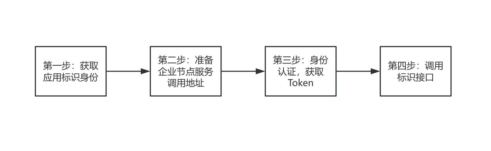

# 兼容接口介绍

## 描述

- 若企业托管在二级，且已使用SNMS API 接口开发标识应用。现部署标准版企业节点，原已对接的标识应用可通过企业节点标准版的兼容接口进行对接，无需重新开发。历史存量数据迁移至新版企业节点后，若需使用企业节点标准版能力，兼容接口无法覆盖全部标准版功能，推荐企业使用企业节点标准版接口对接标识应用；具体关系事例见下图:

- 若企业已使用企业节点社区版接口开发标识应用，现部署标准版企业节点，原社区版接口会继续开放，但不可使用新版本接口操作历史数据。推荐企业使用标准版接口重新对接标识应用，并操作数据；具体关系事例见下图：

## 调用流程

- [获取应用标识身份](../../handle-app-sop/4-develop-introduce/app-develop/step2)
- 准备企业节点服务调用地址 (http\:\//ip:port)
- 调用[身份认证接口](./v5/identity-auth.md#密文传输)，获取token，推荐使用密文接口
- 携带token，调用其他[标识接口](./v5/handle-operate.md)

## 注意事项
- SNMS兼容接口在操作元数据模版和标识时，需要注意元数据模版是否添加了企业节点元数据新特性；若是，该禁止使用该套接口操作数据。
- 第五版接口相比较于第三版接口，有以下功能变动
  1. 新增数据模版编辑接口
  2. 数据模版新增/编辑接口模版属性字段添加启用/禁用状态
  3. 数据模版新增/编辑接口添加模版索引字段
