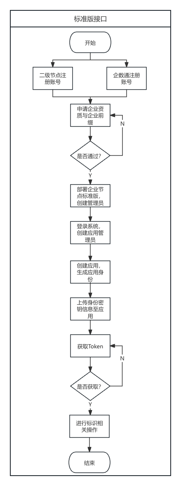

# IDHub标准接口介绍

## 准备工作

1. 前往二级节点标识业务管理系统或在微信小程序企数通中注册用户，并提交资质和企业前缀的申请
2. 微信小程序搜索“企数通”，在企数通中进行用户注册，提交资质和前缀申请
3. 等待二级节点管理员审核资质和企业前缀通过
4. 部署企业节点系统，创建管理员用户 
5. 登录系统，创建应用管理员，向所要对接的标识应用创建身份，生成密钥信息 

## 调用流程
1. 下载应用身份公私钥，并上传至对应应用，用于后续身份认证
2. 提前获取准备企业节点系统服务地址（域名或IP端口，例如：http://127.0.0.1:3000），作为以下接口服务调用地址
3. 调用身份相关接口，获取Token
4. 将Token作为参数，进行元数据和标识的相关操作

