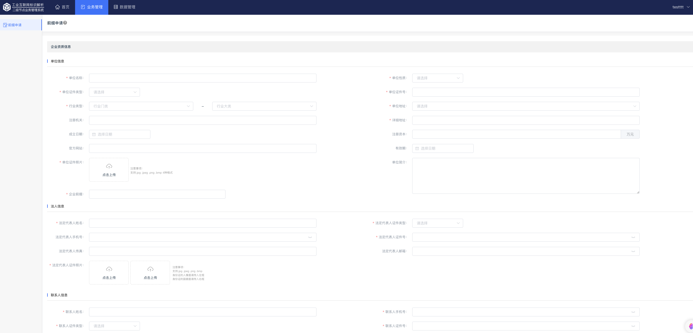

# 企业前缀申请

## 申请说明

企业可在所属二级节点单位申请企业前缀，也可在英福申请企业前缀:

1. 在所属二级节点单位申请企业前缀时，企业需登录二级节点系统，提交申请信息
2. 在英福申请企业前缀时，企业可通过英福二级节点系统申请，也可通过企数通小程序申请
    - 通过英福二级节点系统申请时，登录[英福二级节点系统](https://snms.teleinfo.cn)提交申请信息
    - 通过企数通小程序申请时，可扫描小程序码直接进入小程序，也可通过泰尔英福公众号进入小程序

    

## 操作步骤

以在英福二级节点申请企业前缀为例:

1. 在[泰尔英福二级节点](https://snms.teleinfo.cn)注册企业账号
    

2. 填写企业信息，申请企业前缀
    

3. 联系二级管理员，审核企业申请
    

