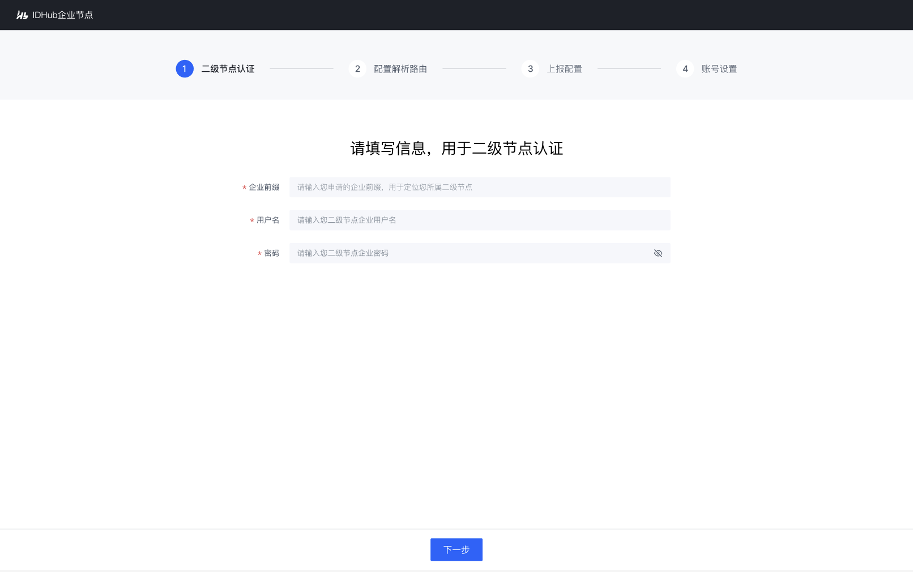
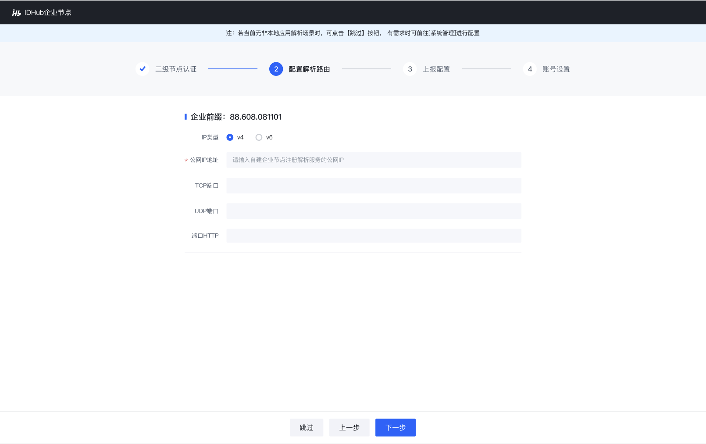
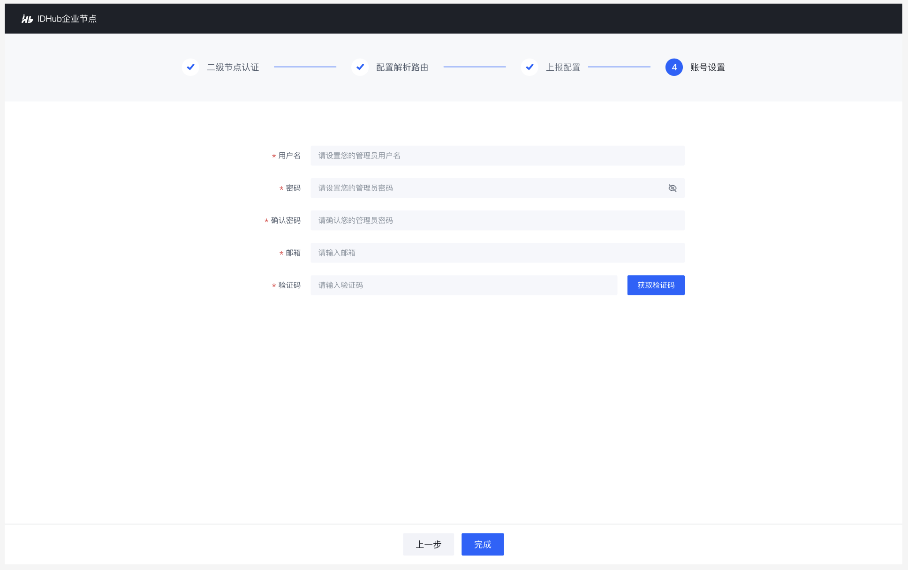

# 企业节点安装

## 安装步骤

### 前置条件

安装企业节点前，需先[申请企业前缀](../3-apply-prefix/introduce.md)

### 安装步骤

1. 在线申请license，企业可通过企数通小程序在线申请license。申请成功后，部署企业节点时，需将[license配置](#install-5)到企业节点中

2. 查看[部署文档](../9-deployment/introduce.md)

3. 获取[软件部署包](https://teleinfo.pek3b.qingstor.com/Ent_deploy.zip)

4. 按部署文档快速部署

说明：
<ul>
<li>企业节点标准版，配套对接二级节点版本需升级为<strong>1.3.19.3</strong>。</li>
<li>IDInside合作伙伴可免费安装试用企业节点标准版，试用周期为3个月。</li>
</ul>

### 后续操作

1. 安装完成后，在浏览器输入企业节点系统地址，进入开机引导
    

2. 在开机引导页，首先完成二级节点认证，实现自动对接二级节点
    

3. 配置企业节点解析服务地址，支撑标识解析时可路由到该标识数据所属的企业节点
    
    
    说明：企业节点解析路由也可在二级节点配置，若企业已在二级节点配置完成，则该步骤无需配置，系统将会自动从二级节点中获取已配置好的解析路由
    
    

    
4. 配置企业节点的管理员账号，确保可成功登录企业节点
    

5. 配置在[安装步骤1](#安装步骤-1)中申请的license，完成企业节点开机
    

6. 进入企业节点登录页，输入管理员账号、密码
    

7. 进入企业节点首页
    

