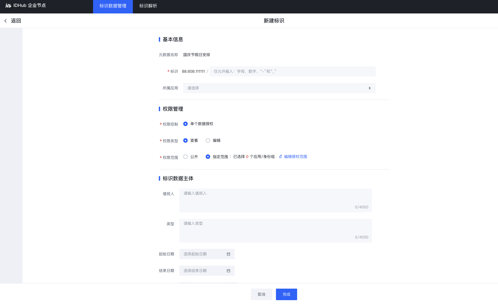

# 标识注册解析

1. 前往标识注册页面，找到所要创建标识的元数据模板，在其列表下新建标识

2. 点击`“新建标识”`按钮，打开标识注册页面，进行标识数据填写
   

3. 标识注册成功，点击`“标识解析”`菜单，在标识解析页面输入已注册数据的标识，进行解析
   

截止此时，企业节点管理员已完成一个简单的标识注册、标识解析流程。

<!-- 企业节点商业版还提供高阶用法，包括[元数据模板关联](../6-idsdk-api/advance.md#元数据模板关联)、[标识关联](../6-idsdk-api/advance.md#标识关联)、[数据权限](../6-idsdk-api/advance.md#同类数据授权)、[数据连接中间件](../5-app-develop/step3-idlink.md)等。 -->

<!-- 其中，数据权限实现数据的安全防护，包括[同类数据授权](../5-app-develop/step3-idlink.md#同类数据授权)和 [单个数据授权](../6-idsdk-api/advance.md#实例标识单个授权)。 -->

<!-- 

说明：

`同类数据授权`指基于某个元数据模板创建标识，该模板下的所有标识，其数据权限策略只需配置一次，所有标识数据遵循同一套数据权限策略。

`单个数据授权`指基于某个元数据模板创建标识，该模板下的每一条标识，其数据权限策略均需单独配置，每一条标识数据的数据权限策略可能均不相同。

 -->
