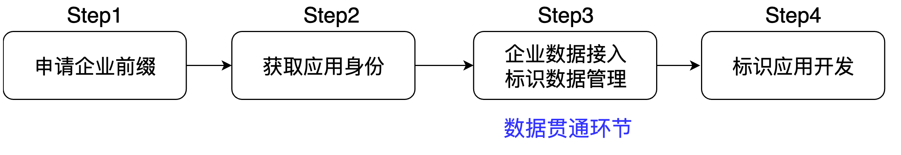

# 开发流程

应用开发者只需4步骤，即可完成标识应用开发落地。

`step1：` 申请一个企业前缀，该企业前缀在标识网络内，是企业节点的一个唯一标记，并通过该企业前缀完成与二级节点对接

`step2：`为待开发的标识应用获取一个应用身份，该身份用于应用系统与企业节点对接时的身份认证及数据授权时的数据权限策略配置

`step3：`将企业侧的数据接入企业节点，生成标准化的标识数据，企业节点对标识数据进行管理，完成数据贯通

`step4：`企业节点提供标识数据服务，上层应用基于[ID-SDK](../../sdk/v2/introduction.md)/[API](../../idhub/standard/introduce.md)获取所需的数据，进行数据、计算、展示、操作、分析等，完成标识应用开发

**后面将以生产企业、仓储企业为例，详细介绍上面的开发流程。**