# IDLink使用方法 

本章节描述通过IDLink将生产系统的产品数据接入企业节点A，仓储系统的入库单数据接入企业节点B，并实现入库单标识关联产品标识。应用开发者无需调用接口，直接在企业节点系统中配置数据接入规则，即可完成元数据模板、标识注册、标识关联、数据权限等相关操作。

##  IDLink接入企业节点

### 前置条件

企业节点A、企业节点B已完成[安装](../3-develop-env/idhub-install.md)

### 操作步骤
1. 登录企业节点标准版系统，进入【标识数据连接中间件接入】菜单
    

2. 点击“接入标识数据连接中间件”按钮，填写中间件的名称、地址，并生成密钥对。密钥对需要在部署的标识数据连接中间件服务中进行配置，用于两个系统交互认证
    
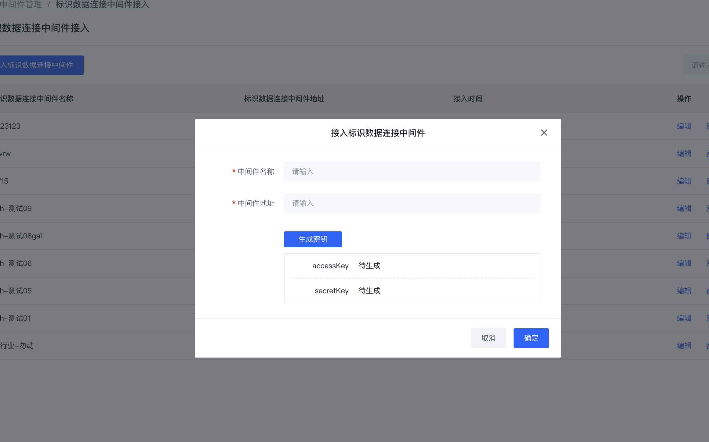

### 后续步骤

企业节点的操作用户创建元数据模板。

## 元数据模板创建

### 前置条件
企业节点A已完成[安装](../3-develop-env/idhub-install.md)，并[申请企业前缀](../3-apply-prefix/introduce.md) `88.608.24060301`
### 操作步骤
1. 企业节点A的操作用户登录企业节点标准版系统，进入【元数据模板】菜单
    

2. 点击“新建元数据”按钮，创建产品元数据模板
    
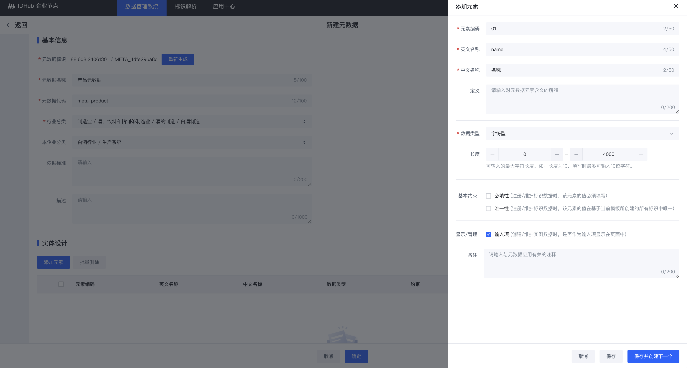

3. 创建完成后，产品元数据模板为“未发布”状态（即为草稿），点击“发布”按钮，产品元数据模板发布为正式态
    

### 后续步骤
1. 依据已创建的产品元数据模板进行元数据模板授权
2. 当该步骤创建的产品元数据模板权限为“公开”时，则可直接进入[元数据模板关联](#元数据模板关联)步骤

## 元数据模板授权

### 前置条件

1. 产品[元数据模板创建](#元数据模板创建)完成
2. [导入B企业标识身份组](../6-idsdk-api/advance.md#advance-import-group)

### 操作步骤
1. 企业节点A的操作用户登录企业节点标准版系统，进入【元数据模板】菜单
    

2. 选择产品元数据模板，点击“管理”按钮
    

3. 将产品元数据模板授权给仓储系统的标识身份
    

### 后续步骤
仓储系统可查看元数据模板授权通知，并完成对产品[元数据模板的关联](#元数据模板关联)。

说明：当元数据模板的权限定义为“公开”时，则不需要执行元数据模板授权操作。

## 元数据模板授权通知

### 前置条件
企业节点A的操作用户，已将产品[元数据模板授权](#元数据模板授权)给仓储系统的标识身份。

### 操作步骤
企业节点B的操作用户登录企业节点标准版系统，查看授权通知。
    

### 后续步骤
仓储系统创建入库单元数据模板并关联产品元数据模板。

## 元数据模板关联

### 前置条件
1. 已完成产品[元数据模板创建发布](#元数据模板创建)
2. 若产品元数据模板“非公开”，则需完成[产品元数据模板授权](#元数据模板授权)

### 操作步骤
1. 企业节点B的操作用户登录企业节点标准版系统，进入【元数据模板】菜单
    

2. 新建入库单元数据模板，并在实体设计中，关联A企业产品元数据
    
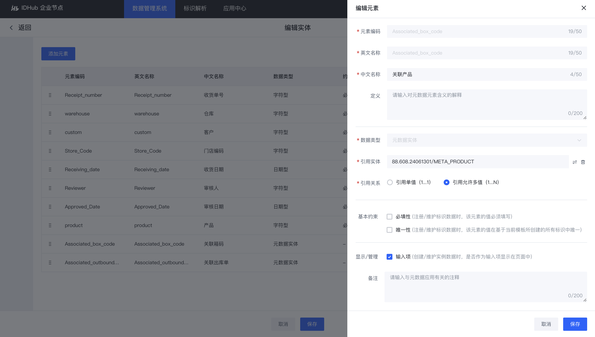

### 后续步骤
前往同类数据授权，对产品标识数据进行授权。

## 同类数据授权

### 前置条件
1. 已完成产品[元数据模板创建](#元数据模板创建)
2. [导入B企业标识身份组](../6-idsdk-api/advance.md#advance-import-group)

### 操作步骤
1. 前往标识注册页面，找到对应元数据模板，对元数据字段进行授权。如此该元数据模板下的所有标识数据，均遵循该数据权限策略
    
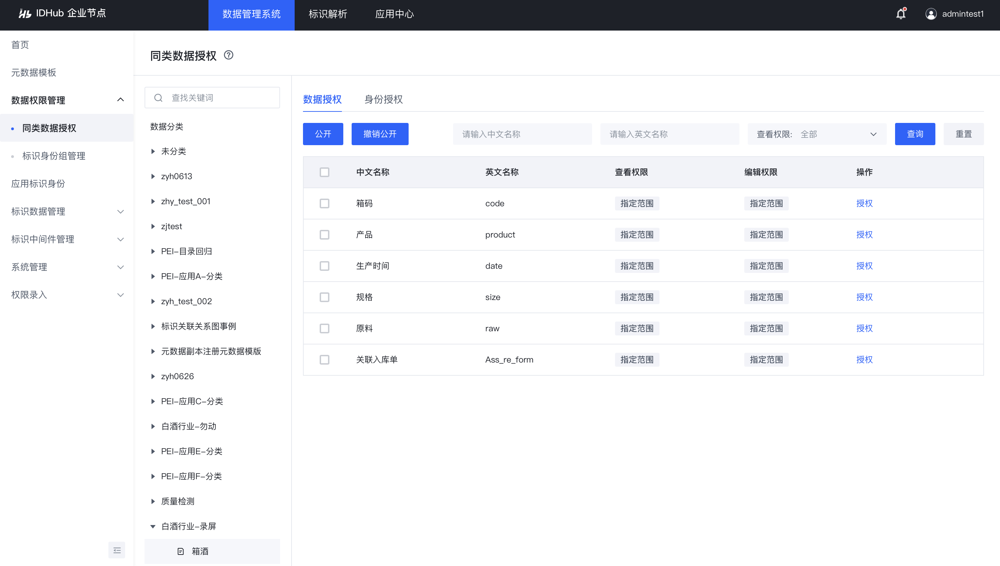

2. 如图所示，我们将“箱码”、“产品”、“生产时间”字段设定为查看公开权限，将“规格”、“原料”、“关联入库单”查看权限授权给仓储系统
    

    
    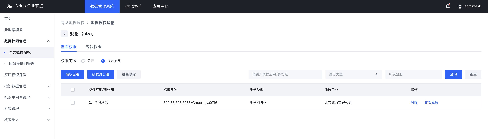
    

   

3. 未将“规格”、“原料”、“关联入库单”查看权限授权给仓储系统时，在企业节点B解析产品标识，只能查看公开字段
    
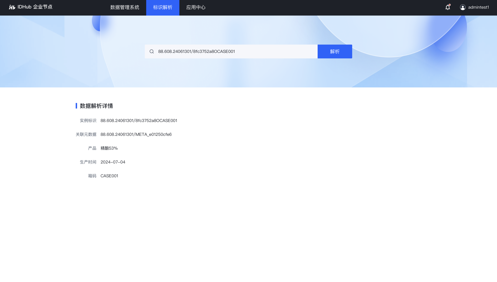

4. 将“规格”、“原料”、“关联入库单”查看权限授权给仓储系统时，在企业节点B解析产品标识，可查看公开字段和被授权的字段
    

### 后续步骤
1. A企业产品数据接入企业节点
2. B企业[入库单数据接入企业节点](#入库单数据接入企业节点)

## 产品数据接入企业节点

### 前置条件
A企业完成产品[元数据模板创建](#元数据模板创建)。

### 操作步骤
1. 新建数据源，连接生产系统的数据库
    

2. 新建数据查询通道，选择产品元数据模板
    

3. 新建基础映射关系，选择生产系统库的产品数据库表，勾选映射字段，并标记主键，构建SQL
    
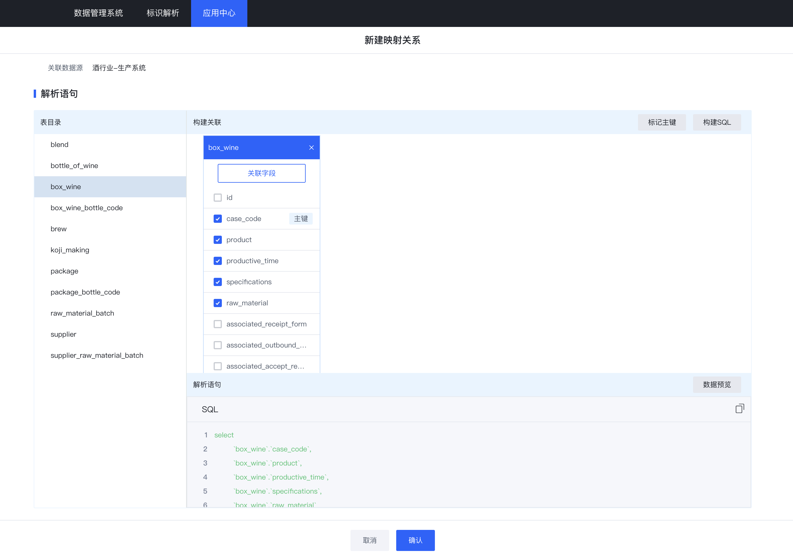

    点击【数据预览】，可以查询出已勾选字段的值
    
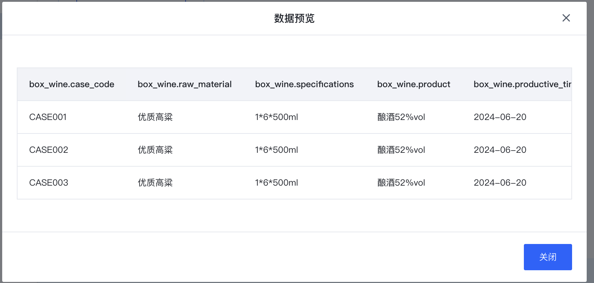

4. 进入数据映射环节，选择元数据字段，与表中勾选的字段做一一映射
    
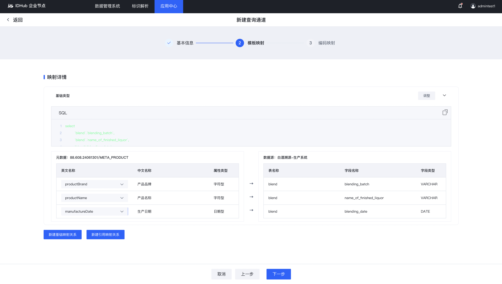

5. 进入标识编码映射环节，系统自动构建映射关系，生成标识编码。标识编码规则为：元数据模板的标识编码+企业私码
    
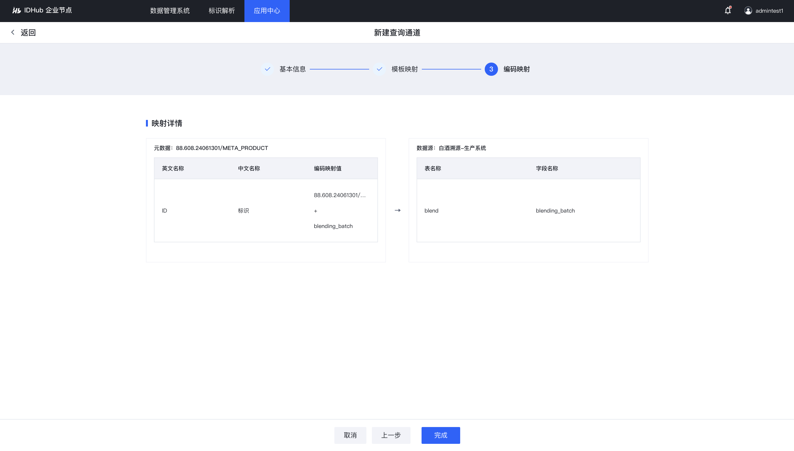

### 后续步骤
截止此时，数据连接通道配置完成，可[解析接入的产品标识](#标识解析)

## 入库单数据接入企业节点

### 前置条件
B企业完成入库单元数据模板创建并[关联](#元数据模板关联)产品元数据模板。

### 操作步骤
1. 新建数据源，连接仓储系统的数据库
    

2. 新建数据查询通道，选择入库单元数据模板
    
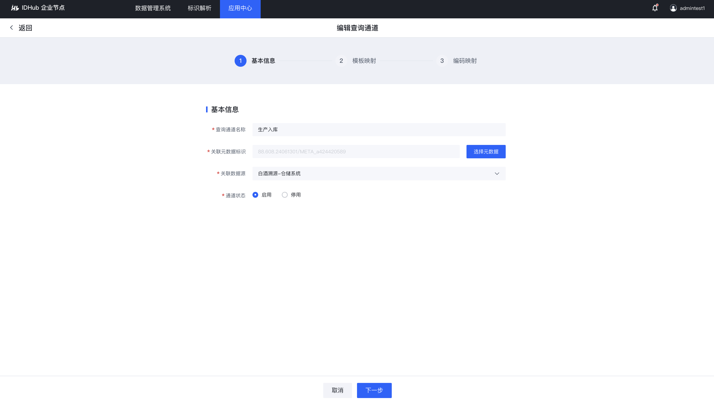

3. 新建基础映射关系，选择入库单数据库表单，勾选映射字段，并标记主键，构建SQL
    
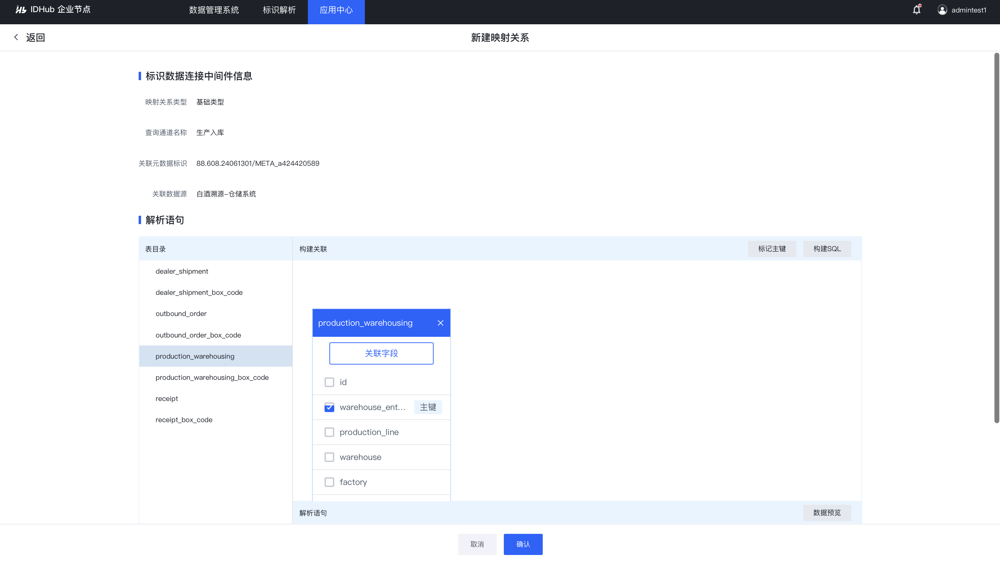

4. 进入数据映射环节，选择元数据字段，与表中勾选的字段做一一映射
    
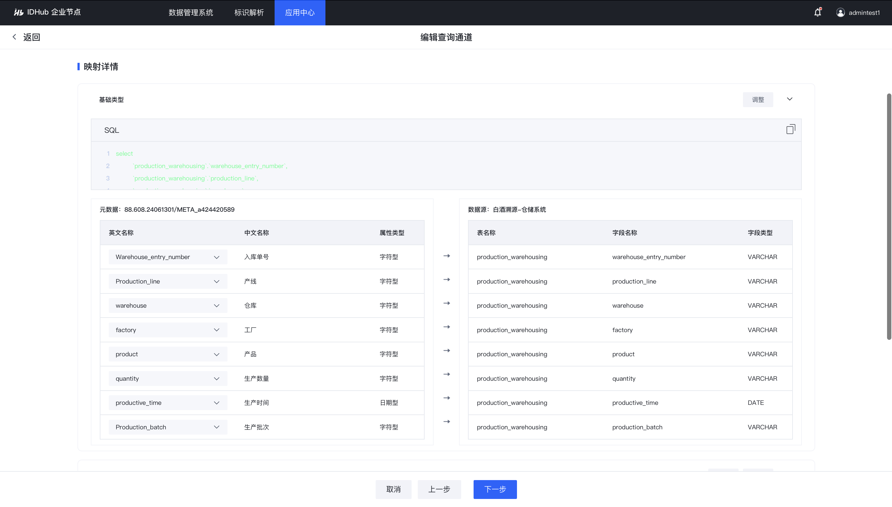

5. 基于入库单元数据模板与产品元数据模板的关联关系，新建数据引用映射关系，勾选关联字段，进行关联字段映射
    
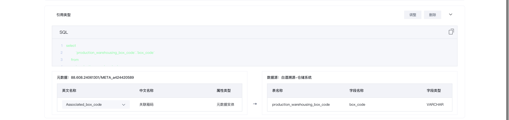

6. 进入标识编码映射环节，系统自动构建映射关系，生成标识编码。标识编码规则为：元数据模板的标识编码+企业私码
    

### 后续步骤
数据连接通道配置完成，可解析接入的入库单标识。
可根据标识编码规则，进行解析，查看[标识数据关系图](#标识数据关系图)。

## 标识解析

### 前置条件
企业节点A完成[产品数据接入](#产品数据接入企业节点)
企业节点B完成[入库单数据接入](#入库单数据接入企业节点)

### 操作步骤
1. 打开标识解析页面，输入产品标识，进行解析
    

2. 输入入库单标识，进行解析
    
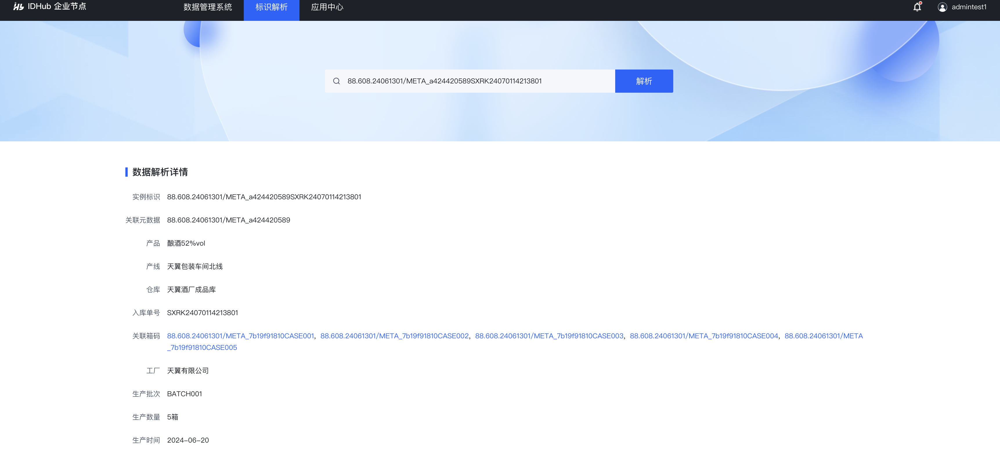

## 标识数据关系图

### 前置条件
1. A企业完成[产品数据接入](#产品数据接入企业节点)
2. B企业完成[入库单数据接入](#入库单数据接入企业节点)

### 操作步骤
1. 打开标识数据关系图页面
    
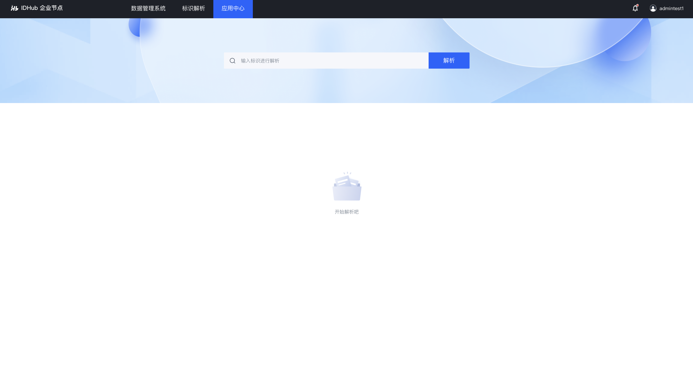

2. 输入入库单标识编码，进行解析
    
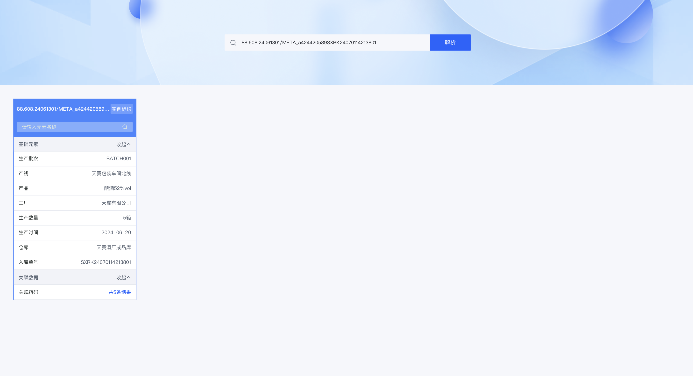

3. 关联数据中，点击关联产品的标识编码进行解析，形成关联关系图
    
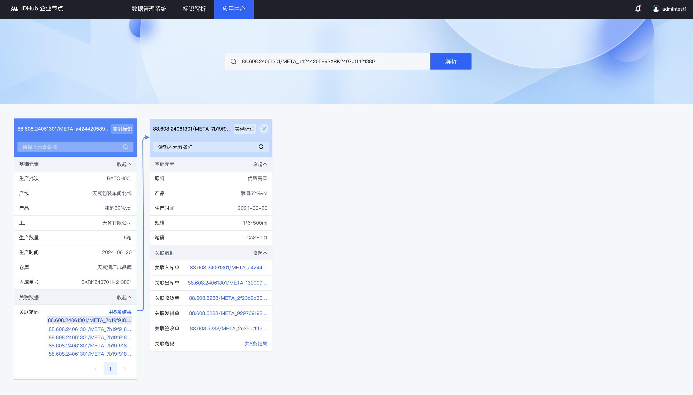

