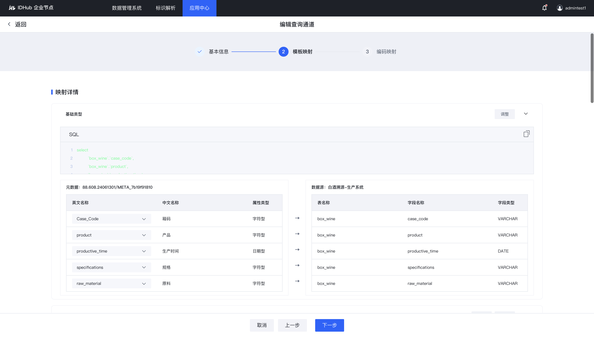
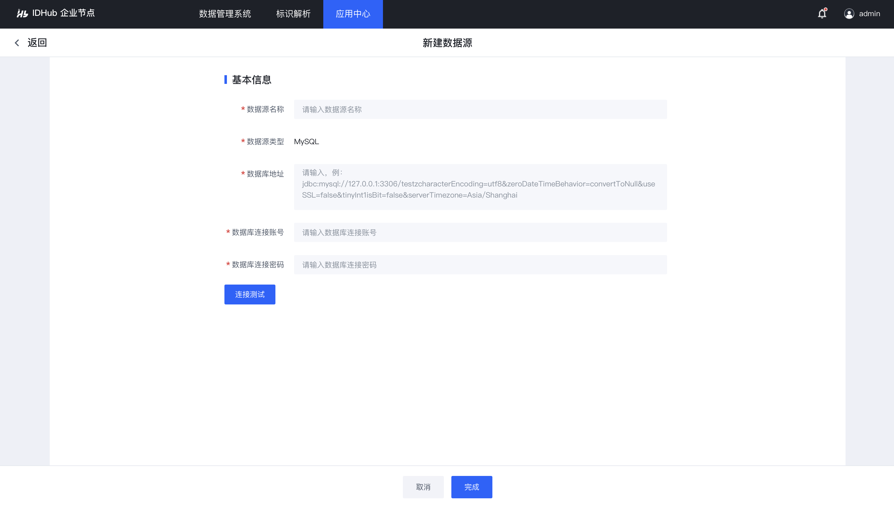

# 通过IDLink接入数据

## IDLink接入企业节点

### 前置条件

企业节点A、企业节点B已完成[安装](../3-develop-env/introduce.md)。

### 操作步骤
1. 登录企业节点标准版系统，进入【标识数据连接中间件接入】菜单。
<center></center>

2. 点“接入标识数据连接中间件”按钮，填写中间件的名称、地址，并生成密钥对。密钥对需要在部署的标识数据连接中间件服务中进行配置，用于两个系统交互认证
<center></center>

例如现在开发一个中间件，需要进行如下配置

```
# 中间件秘钥
app:
  auth:
    ak: ObjgdVB5RFGBchq/uU+hdQ
    sk: j9YqedtWcphJjx5jAlEWdjwyRGy2nA4iYLYhWUEzrGc=
```


### 后续步骤
企业节点的操作用户[创建元数据模板](#产品元数据模板创建).

## 产品元数据模板创建

### 前置条件
企业节点A已完成[安装](../3-develop-env/introduce.md)，并[申请企业前缀](../3-develop-env/introduce.md#企业前缀申请)`88.608.24060301`。

### 操作步骤
1. 企业节点A的操作用户登录企业节点标准版系统，进入【元数据模板】菜单。
<center></center>

2. 点“新建元数据”按钮，创建产品元数据模板
<center></center>

3. 创建完成后，产品元数据模板为“未发布”状态（即为草稿），点“发布”按钮，产品元数据模板发布为正式态
<center></center>


### 后续步骤
1. 依据已创建的产品元数据模板进行[元数据模板授权](#产品元数据模板授权非必须)
2. 当该步骤创建的产品元数据模板权限为“公开”时，则可直接进入[元数据模板关联](#元数据模板关联)步骤


## 产品元数据模板授权（非必须）

### 前置条件
1. 产品[元数据模板创建](#产品元数据模板创建)完成
2. 导入B企业[标识身份组](./sdk-api.md#产品元数据模板授权非必须)

### 操作步骤
1. 企业节点A的操作用户登录企业节点标准版系统，进入【元数据模板】菜单
<center></center>

2. 选择产品元数据模板，点“管理”按钮。
<center></center>

3. 将产品元数据模板授权给仓储系统的标识身份。
<center></center>


### 后续步骤
仓储系统可查看[授权通知信息](#授权通知非必须)，并完成对产品[元数据模板的关联](#元数据模板关联)。
<span style="font-size: 12px; color: rgb(22,93,255);">说明：当元数据模板的权限定义为“公开”时，则不需要执行元数据模板授权操作。</span>


## 授权通知（非必须）
### 前置条件
企业节点A的操作用户，已将产品[元数据模板授权](#产品元数据模板授权非必须)给仓储系统的标识身份。

### 操作步骤
企业节点B的操作用户登录企业节点标准版系统，查看授权通知。
<center></center>


### 后续步骤
仓储系统创建入库单元数据模板并[关联产品元数据模板](#元数据模板关联)


## 元数据模板关联

### 前置条件
1. 已完成产品[元数据模板创建发布](#产品元数据模板创建)
2. 若产品元数据模板“非公开”，则需完成[产品元数据模板授权](./sdk-api.md#产品元数据模板授权非必须)

### 操作步骤
1. 企业节点B的操作用户登录企业节点标准版系统，进入【元数据模板】菜单
<center></center>
2. 新建入库单元数据模板，并在实体设计中，关联A企业产品元数据
<center></center>

### 后续步骤
1. A企业产品数据[接入企业节点](#产品数据接入企业节点)
2. B企业入库单数据[接入企业节点](#产品数据接入企业节点)


## 产品数据接入企业节点

### 前置条件
A企业完成产品[元数据模板创建](#产品元数据模板创建)

### 操作步骤
1. 新建数据源，连接A企业产品数据库
<center></center>
2. 新建数据查询通道，选择产品元数据模板
<center></center>

3. 新建基础映射关系，选择产品数据库表单，勾选映射字段，并标记主键，构建SQL
<center></center>

4. 选择元数据元素，与表字段做一一映射
<center></center>

5. 系统自动生成标识编码规则，进行查看
<center></center>


<span style="font-size: 12px; color: rgb(22,93,255);">说明：产品标识标识数据编码规则为产品元数据标识+选择主键，后续可通过该标识进行解析 </span>

### 后续步骤
可根据标识编码规则，进行解析，查看[标识数据关系图](#标识数据关系图)

## 入库单数据接入企业节点

### 前置条件
B企业完成入库单[元数据模板创建](#产品元数据模板创建)，并[关联A企业产品元数据](#元数据模板关联)。

### 操作步骤
1. 新建数据源，连接A企业产品数据库
<center></center>

2. 新建数据查询通道，选择入库单元数据模板
<center></center>

3. 新建基础映射关系，选择入库单数据库表单，勾选映射字段，并标记主键，构建SQL
<center></center>

4. 选择元数据元素，与表字段做一一映射
<center></center>

5. 新建引用映射关系，勾选关联映射字段，进行关联字段映射
<center></center>

6. 系统自动生成标识编码规则，进行查看
<center></center>


<span style="font-size: 12px; color: rgb(22,93,255);">说明：入库单标识标识数据编码规则为产品元数据标识+选择主键，后续可通过该标识进行解析。</span>

### 后续步骤
可根据标识编码规则，进行解析，查看[标识数据关系图](#标识数据关系图)

## 标识数据关系图

### 前置条件
1. A企业完成[产品数据接入](#产品数据接入企业节点)
2. B企业完成[入库单数据接入](#入库单数据接入企业节点)

### 操作步骤
1. 打开标识数据关系图页面
<center></center>

2. 根据标识编码规则，输入入库单标识编码，进行解析
<center></center>

3. 关联数据中，点击关联产品的标识编码进行解析，形成关联关系图
<center></center>

