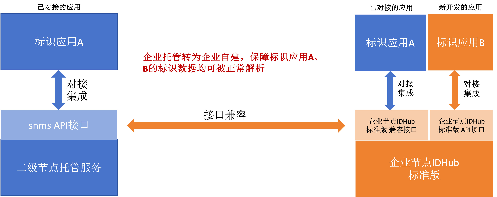
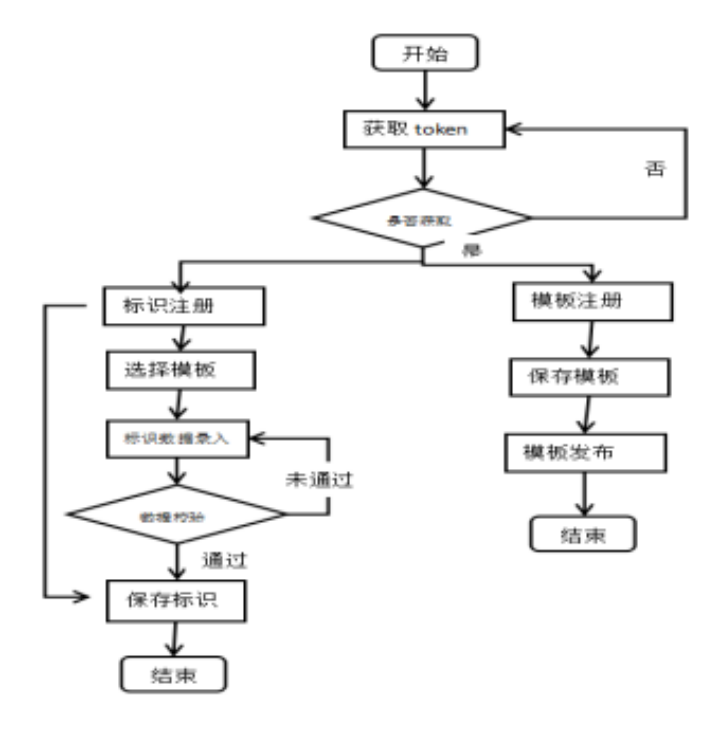

# IDHub兼容二级节点接口介绍

## 描述
- 若企业已使用企业节点社区版接口开发标识应用，现部署标准版企业节点，原社区版接口会继续开放，但不可使用新版本接口操作历史数据。推荐企业使用标准版接口重新对接标识应用，并操作数据；具体关系事例见下图：

- 若企业托管在二级，且已使用SNMS API 接口开发标识应用。现部署标准版企业节点，原已对接的标识应用可通过企业节点标准版的兼容接口进行对接，无需重新开发。历史存量数据迁移至新版企业节点后，若需使用企业节点标准版能力，兼容接口无法覆盖全部标准版功能，推荐企业使用企业节点标准版接口对接标识应用；具体关系事例见下图:

## 准备工作
- 界面注册用户，并提交资质和申请的前缀
- 管理员审核资质
- 审核通过后，企业申请托管
- 管理员审核企业托管申请

## 调用流程
- 调用身份相关接口，获取token
- 将token作为参数，进行标识的相关操作
- 模板数据注册，主要实现中英文替换，定义标识数据模型
- 标识注册必须使用数据模板，并根据数据模型进行标识数据录入
- 流程图

## 注意事项
- SNMS兼容接口在操作元数据模版和标识时，需要注意元数据模版是否添加了企业节点元数据新特性；若是，该禁止使用该套接口操作数据。
