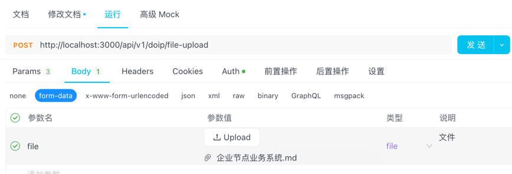

# 文件接口

## 上传文件

通过此接口可上传文件

### 请求参数

- 请求服务：企业节点业务系统HTTP端口（默认 3000）
- 请求方式：POST
- 请求路径：`/api/v1/doip/file-upload`
- Header：

| **参数** | **类型** | **是否必填** | **最大长度** | **备注**                      | **示例值** |
| -------------- | -------------- | ------------------ | ------------------ | ----------------------------------- | ---------------- |
| Authorization  | String         | 是                 | -                  | Bearer + 空格 + token(身份接口获取) | admin            |
| Content-Type   | String         | 是                 | -                  | application/json                    | application/json |

- Body：

| **参数**       | **类型**         | **是否必填** | **最大长度** | **备注** | **示例值**            |
|--------------|----------------|----------| ------------------ |--------|--------------------|
| handleName   | String         | 否        | -                  | 标识     | 88.608.6688/Meta_1 |
| metaHandle   | String         | 是        | -                  | 元数据    | 88.608.6688/Meta_1 |
| fileField    | String         | 是        | -                  | 文件属性   | 88.608.6688/Meta   |
| file         | MultipartFile  | 是        | -                  | 上传的文件  |                |

### 请求示例

> http://localhost:3000/api/v1/doip/file-upload?handleName=&metaHandle=88.608.8889/META_filetest&fileField=file
> 


### 响应参数

| **参数** | **类型** | **最大长度** | **备注**          | **示例值** |
| -------------- | -------------- | ------------------ | ----------------------- | ---------------- |
| status         | Integer        | -                  | 状态码(详见状态码说明） | 1                |
| message        | String         | -                  | 状态码描述              | success          |
| data           | Object         | -                  | 返回数据                |                  |
| data.id        | String         | -                  | 文件id                  | 664da3c5802cf826c367b8c4 |
| data.filePath | String         | -                  | 文件路径                 | 173b5de7-1454-4489-b921-dd6f2fd6d938.md |

### 响应示例

```json
{
  "code": 1,
  "message": "成功",
  "data": {
    "id": "664da3c5802cf826c367b8c4",
    "filePath": "173b5de7-1454-4489-b921-dd6f2fd6d938.md"
  }
}
```

### 异常示例

```json
{
  "message": "非本企业标识",
  "code": 701
}
```


## 文件下载

通过此接口可下载文件

### 请求参数

- 请求服务：企业节点业务系统HTTP端口（默认 3000）
- 请求方式：POST
- 请求路径：`/api/v1/doip/file-acquire`
- Header：

| **参数** | **类型** | **是否必填** | **最大长度** | **备注**                      | **示例值** |
| -------------- | -------------- | ------------------ | ------------------ | ----------------------------------- | ---------------- |
| Authorization  | String         | 是                 | -                  | Bearer + 空格 + token(身份接口获取) | admin            |
| Content-Type   | String         | 是                 | -                  | application/json                    | application/json |

- Body：

| **参数**       | **类型**         | **是否必填** | **最大长度** | **备注** | **示例值**            |
|--------------|----------------|----------| ------------------ |--------|--------------------|
| filePath   | String         | 是        | -                  | 文件路径   | 173b5de7-1454-4489-b921-dd6f2fd6d938.md |

### 请求示例
> http://localhost:3000/api/v1/doip/file-acquire?filePath=173b5de7-1454-4489-b921-dd6f2fd6d938.md

### 响应参数

无

### 响应示例

无

### 异常示例

```json
{
  "message": "非本企业标识",
  "code": 701
}
```
### 注意
> 1. 该接口下载的文件以流的形式返回，需要通过代码处理流来接收
